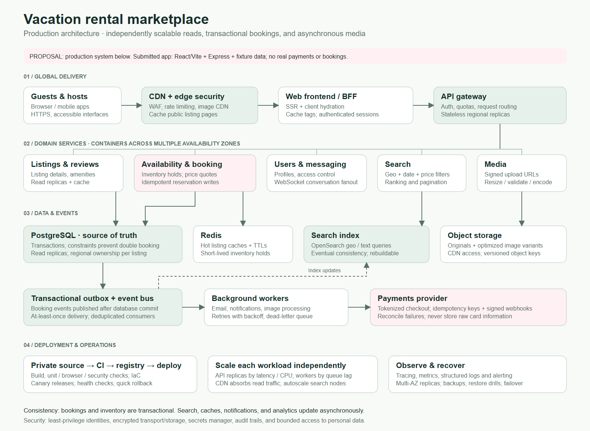

# Production vacation-rental marketplace

The diagram is a proposed production system. The submitted application uses React/Vite, an optional Express API and fixture data; it does not provision this infrastructure.

## Scaling strategy

| Layer | Strategy |
| --- | --- |
| Frontend | Serve image variants and immutable assets through a CDN. Render public listing pages at the server/edge, cache by listing and locale, and hydrate interactive controls. Keep personalized booking/account responses private. |
| APIs | Use stateless regional replicas behind authentication, rate limits and request routing. Scale listing reads independently from booking writes, messaging and media jobs. |
| Primary storage | Use PostgreSQL for listings, accounts, inventory and reservations. Partition/assign ownership by listing or region, with read replicas for read-heavy traffic. Use multi-AZ replication and tested backups. |
| Booking consistency | Recheck price and availability at checkout. Store a unique idempotency key and reserve inventory in a database transaction with constraints/locking. Redis may cache temporary holds, but the database decides whether a booking is valid. |
| Search | Maintain a geo/text index such as OpenSearch from committed listing and availability events. Index updates are eventually consistent; revalidate availability at booking time. Scale shards/replicas with measured query and indexing load. |
| Media | Upload to object storage using short-lived signed URLs. Workers validate and resize originals, publish versioned variants and serve them through the CDN. |
| Events | Use a transactional outbox so database commits cannot lose their corresponding events. Assume at-least-once delivery; deduplicate consumers, retry with backoff and use dead-letter queues. |
| Payments | Use a tokenizing payment provider and signed webhook verification. Apply idempotency at payment and reservation boundaries. Reconcile failed/late payment outcomes with inventory holds. |
| Deployment | Private source, CI validation, immutable images, infrastructure as code and gradual releases with health checks and rollback. Scale API instances by latency/load and workers by queue age. |
| Operations | Trace requests across services, measure booking/search latency and failures, alert on queue lag, and rehearse backup restore and regional failover. Encrypt data, bound access and keep secrets outside source control. |

## Consistency and failure handling

An accepted booking must be unique for the requested inventory interval. Cache misses and a stale search result may slow or reject a request; they must not authorize conflicting reservations. Payment callbacks and queue retries can arrive more than once, so writes and consumers must be idempotent.

Prefer one write owner per listing/region over unconstrained multi-region booking writes. After a region fails, promote ownership through an explicit failover process before accepting new reservations. Search and public pages can remain available while booking writes recover.

## Editable source

The SVG is a standalone editable image. `scripts/render-architecture.mjs` is the source generator; run `npm run architecture` to regenerate the SVG and PNG. The diagram intentionally omits service-internal tables and optional product features so reviewers can see the main request, persistence and deployment boundaries.
